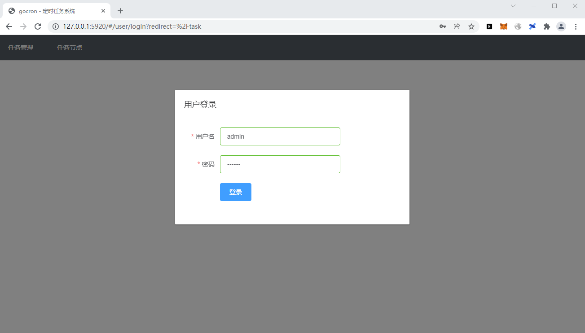
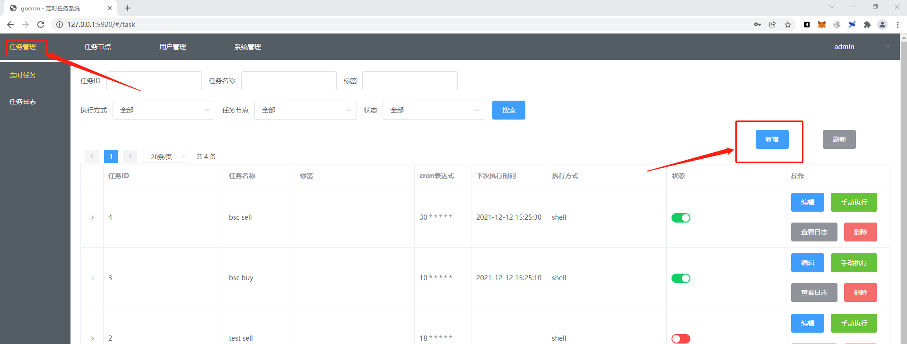
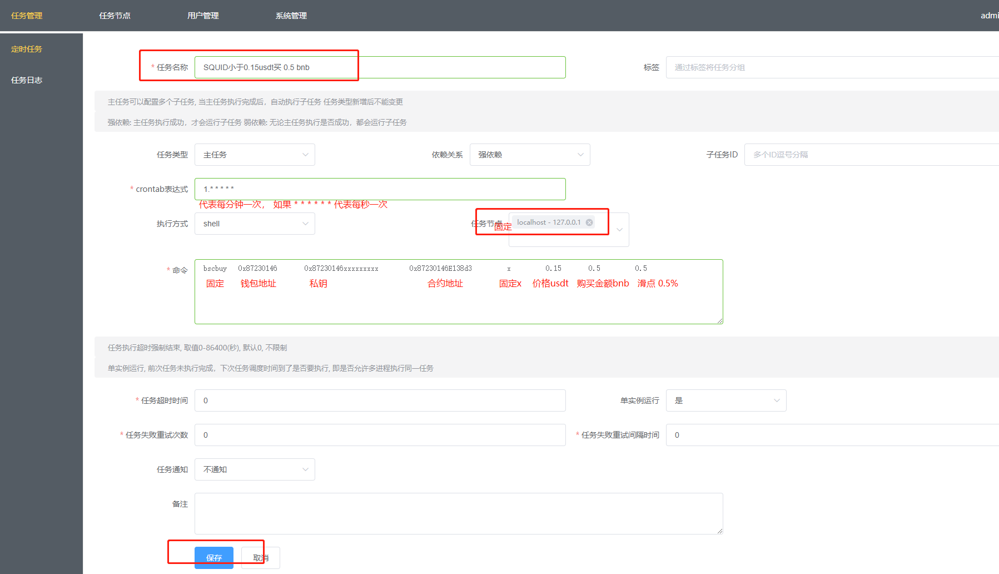
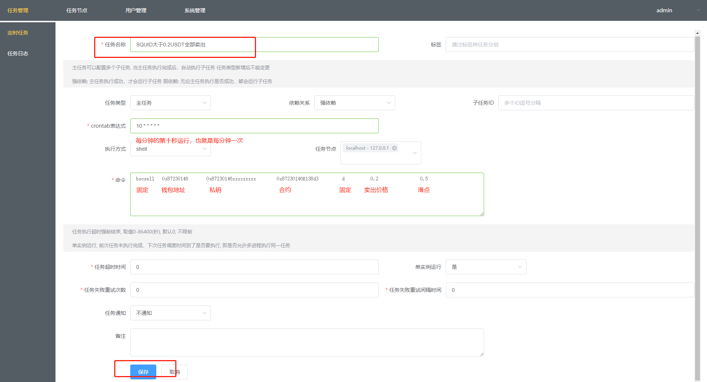
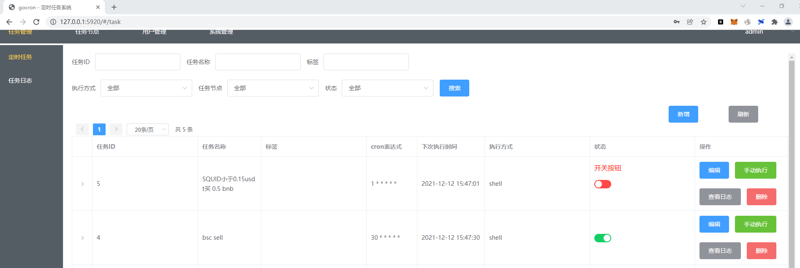

# pancakeswap-bot

# pancakeswap自动交易

注意：建议使用一个小资金的新号使用，电脑不要随意给其他人使用，数据全部记录在本机数据库与日志中。

    买入
    大于2bnb手续费0.3%、0.2-- 2bnb手续费0.8%、低于0.2bnb无手续费。

    卖出
    手续费  0.5%

### 基础环境 
    gocron + mysql

### bsc主网自动交易工具
* bscbuy.exe
* bscsell.exe

### bsc测试链交易工具
* testbscbuy.exe
* testbscsell.exe

### 配置使用

    默认无需配置，直接解压双击就能使用。  
    解压后双击打开“启动.bat”启动环境。  
    1. 会自动打开三个命令行窗口（不要关闭，关闭就无法使用了），
    2. 浏览器自动打开管理后台.（如果不会自动打开管理后台，则请手动访问 http://127.0.0.1:5920）。账号：admin 密码：111111

* 添加自动购买  
> 判断价格小于0.15usdt则买1bnb 滑点设置0.5%。  
<pre>
bscbuy          0xxxxxxx  0xxxxxx  0xxxxxx        x            0.15          1          0.5  
购买固定bscbuy   钱包地址   私钥   合约地址  判断价格小于  买入价0.15usdt  买入额1bnb   滑点0.5%  
</pre>

* 添加自动卖出

> 判断价格大于0.2usdt则全部卖出 滑点设置0.5%。  
<pre>
bscsell        0xxxxxxx   0xxxxxx  0xxxxxx       d            0.2               0.5  
购买固定bscsell   钱包地址   私钥   合约地址  判断价格大于  买出价0.2usdt     滑点0.5%  
</pre>

* 开关按钮 

